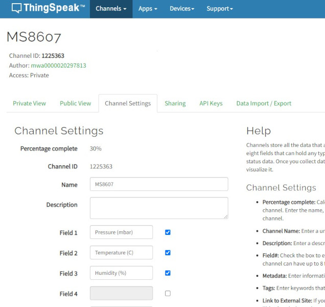
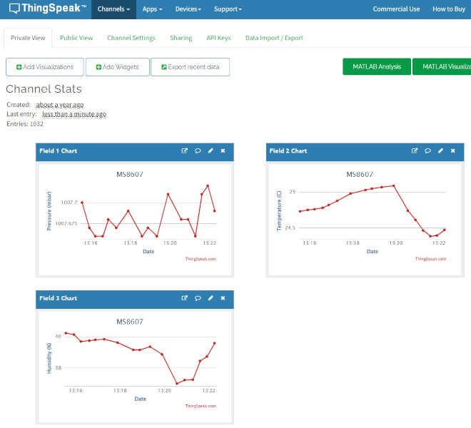

# Example 8 - ESP32 Thing Plus C ThingSpeak Publish - Publishing sensor data to ThingSpeak

A more complex example to show how to publish sensor data to ThingSpeak using SparkFun Qwiic Universal Auto-Detect.

This example was written for the [*SparkFun ESP32 Thing Plus C (SPX-18018)*](https://www.sparkfun.com/products/18018) but can be adapted for other ESP32 platforms.

## Key Features

- Declaring a SFE_QUAD_Sensors object
- Detecting which sensors are connected
- Initializing the sensors
- Setting up a menu
- Configuring the WiFi SSID and password through the menu system
- Configuring the sensor settings through the menu
- Publishing the sensor readings to ThingSpeak
- Writing the settings to EEPROM
- Reading the settings back from EEPROM

This example is very similar to [Example7](ex_07_Thing_Plus_C_Logger_RTC.md). Please see the Example 1, 6 and 7 documentation for a full walk-through of the code.

Let's walk through the key differences:

## EEPROM

In this example, we store the sensor and menu settings in EEPROM, instead of on microSD card.
We don't need the microSD card as this example as not logging any data as such, the sensor data is uploaded to ThingSpeak and they log it for us.
(This allows this example to run on ESP32 boards which don't have microSD on-board!)

```C++
#include <EEPROM.h> // Include EEPROM.h to enable support for SFE_QUAD_Sensors__EEPROM. Do this before #include "SFE_QUAD_Sensors.h"

#include "SFE_QUAD_Sensors.h" // Click here to get the library:  http://librarymanager/All#SparkFun_Qwiic_Universal_Auto-Detect

SFE_QUAD_Sensors__EEPROM mySensors;
```

## ThingSpeak

[ThingSpeak](https://thingspeak.com/) from MathWorks is an IoT analytics platform service that allows you to aggregate, visualize, and analyze live data streams in the cloud.
SparkFun has been a fan of ThingSpeak [for many years](https://www.sparkfun.com/news/2413).

ThingSpeak have made life really easy for us by providing an Arduino Library which lets you upload your data straight to your ThingSpeak channel. You can then view the
analytics on your phone or computer, privately or publicly.

You can install the ThingSpeak library through the Arduino IDE Library Manager: search for **ThingSpeak**.

```C++
#include <ThingSpeak.h> // Click here to get the library:  http://librarymanager/All#ThingSpeak
```

ThingSpeak uses an ESP32 WiFiClient to upload the data:

```C++
#include <WiFi.h>

WiFiClient myClient;
```

In ```setup()```:

```C++
  WiFi.mode(WIFI_STA);

  ThingSpeak.begin(myClient);  // Initialize ThingSpeak
```

## The Menu

ThingSpeak requires a ```Write API Key``` (essentially an encrypted username and password) and your ```Channel ID```.
These are available once you have set up a (free) account and have created a channel:




Each Channel ID can have up to eight "fields". In this example, the code uploads the first (up to) eight sense readings to whichever ThingSpeak channel you select.

The Write API Key and Channel ID are of course stored in the menu, together with the ```Publish interval (ms)```:

```C++
  // ThingSpeak sub-menu: set the publish interval etc.
  mySensors.theMenu.addMenuItem("ThingSpeak Menu", SFE_QUAD_MENU_VARIABLE_TYPE_SUB_MENU_START);
  mySensors.theMenu.addMenuItem("", SFE_QUAD_MENU_VARIABLE_TYPE_NONE);
  mySensors.theMenu.addMenuItem("ThingSpeak Menu", SFE_QUAD_MENU_VARIABLE_TYPE_NONE);
  mySensors.theMenu.addMenuItem("============", SFE_QUAD_MENU_VARIABLE_TYPE_NONE);
  mySensors.theMenu.addMenuItem("", SFE_QUAD_MENU_VARIABLE_TYPE_NONE);
  mySensors.theMenu.addMenuItem("Write API Key", SFE_QUAD_MENU_VARIABLE_TYPE_TEXT);
  mySensors.theMenu.setMenuItemVariable("Write API Key", "REPLACE_WITH_YOUR_KEY"); // Set the default API Key - this will be updated by readLoggerConfig
  mySensors.theMenu.addMenuItem("Channel ID", SFE_QUAD_MENU_VARIABLE_TYPE_ULONG);
  SFE_QUAD_Menu_Every_Type_t defaultValue;
  defaultValue.ULONG = 1;
  mySensors.theMenu.setMenuItemVariable("Channel ID", &defaultValue); // Set the default channel number
  mySensors.theMenu.addMenuItem("Publish interval (ms)", SFE_QUAD_MENU_VARIABLE_TYPE_ULONG);
  defaultValue.ULONG = 60000;
  mySensors.theMenu.setMenuItemVariable("Publish interval (ms)", &defaultValue); // Set the default publish interval
  defaultValue.ULONG = 15000;
  mySensors.theMenu.setMenuItemVariableMin("Publish interval (ms)", &defaultValue); // Minimum interval is 15 seconds
  defaultValue.ULONG = 3600000;
  mySensors.theMenu.setMenuItemVariableMax("Publish interval (ms)", &defaultValue);
  mySensors.theMenu.addMenuItem("", SFE_QUAD_MENU_VARIABLE_TYPE_NONE);
  mySensors.theMenu.addMenuItem("", SFE_QUAD_MENU_VARIABLE_TYPE_SUB_MENU_END); // End of the sub-menu
```

- ```Write API Key``` is **SFE_QUAD_MENU_VARIABLE_TYPE_TEXT**
- ```Channel ID``` is **SFE_QUAD_MENU_VARIABLE_TYPE_ULONG** (unisgned long)
- ```Publish interval (ms)``` is also **SFE_QUAD_MENU_VARIABLE_TYPE_ULONG** (unisgned long)

The fastest you can send data to ThingSpeak is once every 15 seconds, so we set the minimum ```Publish interval (ms)``` to 15000.

## Publishing the Sense Readings

The code uses the ThingSpeak ```setField``` and ```writeFields``` methods to upload up to eight sense readings to your channel.

```C++
    // ThingSpeak channels can have up to 8 fields
    // Extract up to 8 Strings from mySensors.readings using strtok_r
    unsigned int fieldNum = 1;
    char *preserve;
    char *field = strtok_r(mySensors.readings, ",", &preserve); // Separate the CSV data into keys at each comma
    int result = TS_OK_SUCCESS;
    
    while ((field != NULL) && (fieldNum <= 8) && (result == TS_OK_SUCCESS))
    {
      if ((strchr(field, 'e') != NULL) || (strchr(field, 'E') != NULL)) // Does field contain exponent-format data?
      {
        double val;
        if (mySensors._sprintf.expStrToDouble(field, &val)) // Convert exponent-format string to double
          result = ThingSpeak.setField(fieldNum, (float)val); // Cast double to float
        else
          result = TS_ERR_NOT_INSERTED;
      }
      else
        result = ThingSpeak.setField(fieldNum, String(field)); // Use the string-format data as-is
```

The channel ID and API key are copied from the menu and included in the call to ```writeFields```:

```C++
        SFE_QUAD_Menu_Every_Type_t channelNumber;
        mySensors.theMenu.getMenuItemVariable("Channel ID", &channelNumber); // Get the channel number

        char myWriteAPIKey[33];
        mySensors.theMenu.getMenuItemVariable("Write API Key", myWriteAPIKey, 33);
        
        result = ThingSpeak.writeFields(channelNumber.ULONG, myWriteAPIKey);
```

## WiFi Connection

The ESP32 WiFi of course needs to be connected so the sensor readings can be uploaded. Periodically the WiFi connection may drop out and need to be re-connected.
The code therefore includes a ```wifiConnect()``` helper which will (re)connect if required using the SSID and password from the menu:

```C++
// Connect to WiFi
void wifiConnect(void)
{
  if (WiFi.status() == WL_CONNECTED)
  {
    serialQUAD.println("WiFi is already connected! Disconnecting...");
    
    WiFi.disconnect(true);
    WiFi.mode(WIFI_OFF);
    delay(5000);    
  }

  char ssid[32];
  mySensors.theMenu.getMenuItemVariable("WiFi SSID", ssid, 32);
  char password[32];
  mySensors.theMenu.getMenuItemVariable("WiFi password", password, 32);

  serialQUAD.printf("Connecting to %s ", ssid);

  WiFi.begin(ssid, password);

  const unsigned long wifiConnectTimeout = 10000; // Allow 10s for WiFi connection
  unsigned long startTime = millis();
  
  while ((WiFi.status() != WL_CONNECTED) && (millis() < (startTime + wifiConnectTimeout)))
  {
    delay(500);
    serialQUAD.print(".");
  }

  if (WiFi.status() == WL_CONNECTED)
    serialQUAD.println(" CONNECTED");
  else
    serialQUAD.println(" Connection failed! Please try again...");
}
```

## ThingSpeak Charts

Once your data is being written to ThingSpeak, it is easy to create charts of the sensor readings:


